# Стеганографического встраивания информации в пространственную область цифровых изображений

## СОДЕРЖАНИЕ
- [Задание на практическую работу](#1задание-на-практическую-работу)  
- [Краткая теоретическая часть](#2краткая-теоретическая-часть)  
  - [Метод LSB](#21-метод-lsb)  
  - [Метод PM1](#22-метод-pm1)  
  - [Метод QIM](#23-метод-qim)  
  - [Метод PVD](#24-метод-pvd)  
  - [Метод NMI](#25-метод-nmi)  
  - [Оценка эффективности встраивания](#26-оценка-эффективности-встраивания)  
- [Программная реализация стеганографического метода QIM для цифровых изображений](#3-программная-реализация-стеганографического-метода-qim-для-цифровых-изображений)  
- [Вычислительные эксперименты](#4вычислительные-эксперименты)  
  - [Встраивание максимально возможного объема информации](#41-встраивание-максимально-возможного-объема-информации)  
  - [Измерение метрики незаметности встраивания](#42-измерение-метрики-незаметности-встраивания)  
  - [Встраивание сообщения с последующим сжатием](#43-встраивание-сообщения-с-последующим-сжатием)  
  - [Сравнение гистограмм изображений до и после встраивания](#44-сравнение-гистограмм-изображений-до-и-после-встраивания)  
- [Выводы о проделанной работе](#5выводы-о-проделанной-работе)  
- [Список использованных источников](#6список-использованных-источников)  

# 1 Задание на практическую работу

Целью данной работы является приобретение навыков программной реализации стеганографического встраивания информации в пространственную область цифровых изображений.

В рамках практической работы **необходимо выполнить следующее**:

1. написать программную реализацию одного из следующих стеганографических методов для цифровых изображений по выбору студента: QIM, PVD, NMI;
  
2. провести вычислительные эксперименты с полученной программной реализацией и сделать выводы об эффективности рассмотренного метода встраивания.
    
Программа должна обладать следующей **функциональностью**:

1.  при встраивании:

* принимать на вход цветное (RGB) изображение-контейнер;
* принимать на вход сообщение для встраивания;
* рассчитывать показатели качества встраивания.

2.  при извлечении принимать на вход цветное стегоизображение;

3.  осуществлять встраивание или извлечение информации по выбору пользователя.

**Вычислительные эксперименты** с полученной программной реализацией должнывключать следующее:

1. встраивание максимально возможного для данного контейнера объема информации с оценкой незаметности встраивания;
2.  встраивание разного количества информации и сравнение незаметности встраивания;
3.  извлечение встроенной информации из стегоизображений в условиях тсутствия постобработки и при наличии различных операций обработки зображений, оценка робастности;
4.  сравнение гистограмм изображений до и после встраивания.

# 2 Краткая теоретическая часть

Стеганография – это наука о скрытой передаче и хранении информации
таким образом, чтобы сам факт наличия этой информации был тайной для
третьих лиц. Цифровая стеганография работает с цифровой информацией. В
качестве контейнеров для секретных сообщений могут выступать самые
разные цифровые объекты: мультимедиа-данные, исполняемые файлы,
интернет-трафик, данные с датчиков «интернета вещей» и т.д.

Одним из наиболее распространенных типов контейнеров для
стеганографического встраивания являются цифровые изображения. В первую
очередь это связано с их высокой избыточностью: наиболее
распространенная цветовая модель RGB содержит $2^{24}$ различных цветов,
поэтому небольшое изменение оттенка отдельных пикселей остается
незаметным для глаза человека. Кроме того, цифровые изображения обладают
так называемой пространственной избыточностью, которая состоит в том,
что соседние пиксели изображения в большинстве случаев похожи друг на
друга. Это свойство также широко используется в методах обработки
цифровых изображений.

Существует большое количество различных методов встраивания
дополнительной информации в цифровые изображения, отличающихся разными
особенностями. Все существующие методы делятся на два больших класса:
методы пространственного встраивания и методы частотного встраивания.
Методы пространственного встраивания напрямую изменяют значения пикселей
изображения, в то время как методы частотного встраивания вносят
изменения в значения частотных коэффициентов, полученных после
применения некоторого частотного преобразования к матрице пикселей.

## 2.1 МЕТОД LSB

Одним из самых простых методов пространственного встраивания является
метод замены наименее значимых битов (Least Significant Bits, LSB)
\[1\]. Для встраивания секретное сообщение необходимо преобразовать в
двоичную последовательность. Метод LSB предполагает замену одного или
нескольких младших битов пикселей битами секретного сообщения при
встраивании информации. Чтобы извлечь встроенную информацию, необходимо
последовательно обойти пиксели изображения и сформировать
последовательность из нужного количества младших битов каждого пикселя.

## 2.2 МЕТОД PM1

Метод «плюс-минус один» (Plus-Minus One, PM1) является модификацией
метода LSB. Данный метод меняет младший бит пикселя на бит сообщения
посредством случайного уменьшения или увеличения значения пикселя на
единицу в следующих случаях:

- если значение пикселя четное, и бит секретного сообщения равен
  единице;

- если значение пикселя нечетное, и бит секретного сообщения равен нулю.

Соответствующая формула встраивания имеет вид:

$$
P'_i =
\begin{cases}
P_i + (-1)^r, & \text{если } P_i \bmod 2 \ne m_i\\
P_i, & \text{иначе}
\end{cases}
$$

где $P_{i}$ – значение пикселя изображения до встраивания, $P_{i}'$ –
значение пикселя после встраивания, $r$ – случайное число из множества {0,1}

Чтобы извлечь встроенную информацию, необходимо, как и в методе LSB,
последовательно обойти пиксели изображения и сформировать
последовательность из нужного количества младших битов каждого пикселя.

## 2.3 МЕТОД QIM

Метод модуляции индекса квантования (Quantization Index Modulation, QIM)
\[3\] состоит в изменении значений пикселей изображения в зависимости от
значений встраиваемых битов сообщения. Данная операция называется
модуляцией. Встраивание бита $m_{i}$ осуществляется в пиксель контейнера
$P_{i}$ по формуле

$$P_{i}' = q \cdot \left\lfloor \frac{P_{i}}{q} \right\rfloor + \frac{q}{2} \cdot m_{i},$$

где $q$ – шаг квантования (четное число),
$\left\lfloor \ldots \right\rfloor$ – взятие целой части от деления.

Для извлечения моделируется ситуация встраивания в пиксель $P_{i}'$
нулевого и единичного битов, после чего результирующий бит определяется
на основании того, к какому из двух значений ближе имеющееся значение
$P_{i}'$. Формула извлечения одного бита выглядит следующим образом:

$$ m_i = \arg\min_{e \in \{0,1\}} |P'_i - [P''_i]_e|, [P''_i]_e = q \cdot \left\lfloor \frac{P'_i}{q} \right\rfloor + \frac{q}{2} \cdot e $$

## 2.4 МЕТОД PVD

В методе разности значений пикселей (Pixel Value Difference, PVD) \[4\]
изображение разбивается на непересекающиеся пары пикселей
$\left( P_{i},P_{i + 1} \right)$ и для каждой пары считается разность их
значений $d_{k} = P_{i} - P_{i + 1}$, $k = \frac{i + 1}{2}$. Абсолютное
значение разности пары пикселей $\left| d_{k} \right|$ попадает в один
из шести отрезков вида $\left\lbrack l_{k},u_{k} \right\rbrack$. Эти
отрезки заданы заранее и обычно определяются следующим образом:
$\lbrack 0,\ 7\rbrack$, $\lbrack 8,\ 15\rbrack$,
$\lbrack 16,\ 31\rbrack$, $\lbrack 32,\ 63\rbrack$,
$\lbrack 64,\ 127\rbrack$, $\lbrack 128,\ 255\rbrack$.

Количество битов сообщения, которое может быть встроено в пару пикселей
$\left( P_{i},P_{i + 1} \right)$, определяется по формуле

$$n_{k} = \log_{2}{(u_{k} - l_{k} + 1)} $$                       

Далее фрагмент сообщения длиной $n_{k}$ битов представляется в виде
целого числа $m_{k}$ и вычисляется новое значение разности $d_{k}^{*}$
для данной пары пикселей по формуле:

$$
d_k^* =
\begin{cases}
l_k + m_k, & \text{если } d_k \geq 0 \\
-(l_k + m_k), & \text{если } d_k < 0
\end{cases}
$$

Встраивание фрагмента сообщения $m_{k}$ в пару пикселей осуществляется
по формуле:

$$
(P_{i}', P_{i + 1}')=
\begin{cases}
\left( P_i + \left\lceil \frac{(d_k^* - d_k)}{2} \right\rceil , P_{i+1} - \left\lfloor \frac{(d_k^* - d_k)}{2} \right\rfloor \right), & \text{если } d_k \text{ – нечетное, } \\
\left( P_i + \left\lfloor \frac{(d_k^* - d_k)}{2} \right\rfloor , P_{i+1} - \left\lceil \frac{(d_k^* - d_k)}{2} \right\rceil \right), & \text{если } d_k \text{ – четное. }
\end{cases}
$$

Извлечение сообщения выполняется по формуле

$$m_{k} = \left| P_{i}' - P_{i + 1}' \right| - l_{k}.$$

## 2.5 МЕТОД NMI

Метод встраивания на основе интерполяции по среднему значению соседей
(Neighbor Mean Interpolation, NMI) устроен следующим образом. Исходное
изображение $C$ разрешением $m \times n$ преобразуется в изображение $P$
разрешением $2m \times 2n$ по схеме, представленной на рисунке ниже. Именно
изображение $P$ выступает в качестве контейнера для встраивания
сообщения.

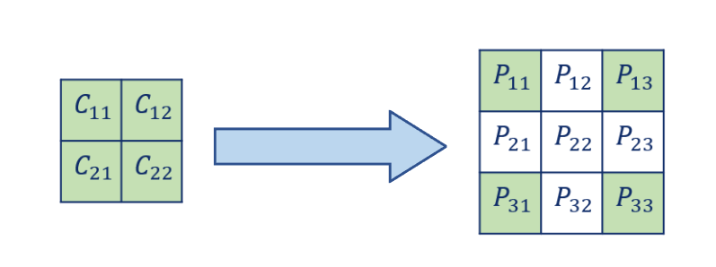 

Значения пикселей изображения $P$ рассчитываются по следующим формулам:

$$P_{11} = C_{11};$$

$$P_{13} = C_{12};$$

$$P_{31} = C_{21};$$

$$P_{33} = C_{22};$$ 

$$P_{12} = \left\lfloor \frac{P_{11} + P_{13}}{2} \right\rfloor;$$

$$P_{21} = \left\lfloor \frac{P_{11} + P_{31}}{2} \right\rfloor;$$

$$P_{22} = \left\lfloor \frac{P_{11} + P_{12} + P_{21}}{3} \right\rfloor.$$

После этого для каждого из непересекающихся блоков пикселей размером
$2 \times 2$ интерполированного изображения $P$ вычисляется три
разностных значения по следующей формуле:

$$d_{ij} = P_{ij} - P_{d},$$

где $P_{d}$ – левый верхний пиксель блока.

Фрагмент сообщения длиной
$n_{k} = \left\lfloor \log_{2}\ \left| d_{ij} \right| \right\rfloor$
битов представляется в виде целого числа $m_{k}$ и встраивается в
пиксель $P_{ij}$ по формуле

$$P_{ij}' = P_{ij} + m_{k}$$

Таким образом, в каждый блок пикселей размером $2 \times 2$ может быть
встроено три фрагмента сообщения.

Чтобы извлечь сообщение из стегоконтейнера $P'$, сначала необходимо
восстановить изображение $C$ и посредством интерполяции сформировать
изображение $P$, как это показано на рисунке ниже.

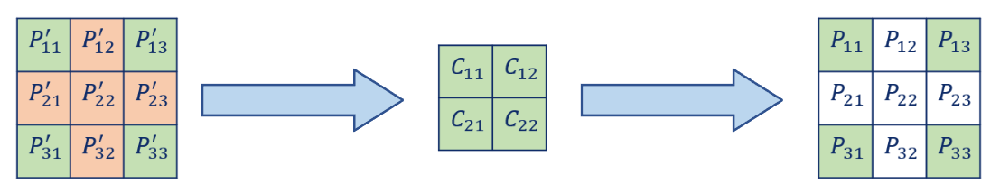 

После этого стегоизображение $P'$ разбивается на блоки размером
$2 \times 2$ пикселя и из каждого блока извлекается три фрагмента
встроенного сообщения по формуле

$$m_{k} = P_{ij}' - P_{ij}$$

## 2.6 ОЦЕНКА ЭФФЕКТИВНОСТИ ВСТРАИВАНИЯ

Для оценки качества стеганографического встраивания информации в
изображения используются различные характеристики. Наиболее
распространенными из них являются незаметность и емкость встраивания.
Незаметность отражает различие между изображениями до и после
встраивания и обычно оценивается метриками PSNR, MSE, RMSE, SSIM:

$$\text{PSNR }\left( \text{dB} \right) = 10 \times \log_{10}\left( \frac{255^{2}}{\text{MSE}} \right),$$

$$\text{MSE} = \frac{1}{M \times N}\sum_{i = 1}^{M}{\sum_{j = 1}^{N}\left( P_{ij} - P_{ij}' \right)^{2}},$$

$$\text{RMSE} = \sqrt{\text{MSE}},$$

где $P_{ij}$ – значение пикселя изображения-контейнера, $P_{ij}'$ –
значение пикселя изображения с вложением;

$$\text{SSIM} = \frac{\left( 2\mu_{P}\mu_{S} + K_{1} \right) \times \left( 2\sigma_{PS} + K_{2} \right)}{\left( \mu_{P}^{2} + \mu_{S}^{2} + K_{1} \right) \times \left( \sigma_{P}^{2} + \sigma_{S}^{2} + K_{2} \right)},$$

где $\mu_{P}$ – среднее значение пикселей изображения-контейнера,
$\mu_{S}$ – среднее значение пикселей изображения с вложением,
$\sigma_{P}^{2}$ – дисперсия пикселей изображения-контейнера,
$\sigma_{S}^{2}$ – дисперсия пикселей изображения с вложением,
$\sigma_{PS}$ – ковариация между пикселями обоих изображений, $K_{1}$ и
$K_{2}$ – константы.

Емкость показывает, сколько битов встроенной информации приходится на
каждый пиксель изображения, и выражается следующей формулой:

$$\text{EC}\mspace{6mu}\left( \text{bpp} \right) = \frac{B}{M \times N},$$

где $M \times N$ – размеры изображения, $B$ – это общее число битов,
встроенных в изображение.

Для оценки устойчивости встраивания к деструктивным воздействиям, таким
как изменение яркости, JPEG-сжатие и т.д. обычно применяются метрики BER
и NCC:

$$\text{BER} = \frac{B_{e}}{B},$$

где $B_{e}$ – количество ошибок, возникших при извлечении (измененных
битов);

$$\text{NCC} = \frac{\sum_{x = 1}^{M}{\sum_{y = 1}^{N}\left( W(x,y) \times W_{ext}(x,y) \right)}}{\sqrt{\sum_{x = 1}^{M}{\sum_{y = 1}^{N}\left( W^{2}(x,y) \right)}}\sqrt{\sum_{x = 1}^{M}{\sum_{y = 1}^{N}\left( W_{ext}^{2}(x,y) \right)}}},$$

где $W(x,y)$ – исходное сообщение, $W_{ext}(x,y)$ – извлеченное
сообщение.

Метрика NCC обычно применяется, когда встроенное сообщение является
изображением.

Важным показателем качества стеганографического встраивания является
устойчивость перед стегоанализом. Существует множество схем стегоанализа
для пространственной области изображений. Простейшие из них анализируют
сходство гистограмм изображений до и после встраивания.

# 3 Программная реализация стеганографического метода QIM для цифровых изображений

Программная реализация метода QIM представлена на трёх рисунках ниже.

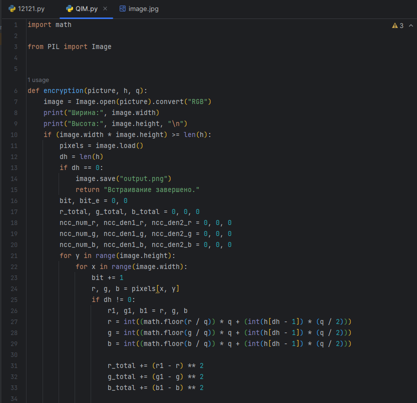 
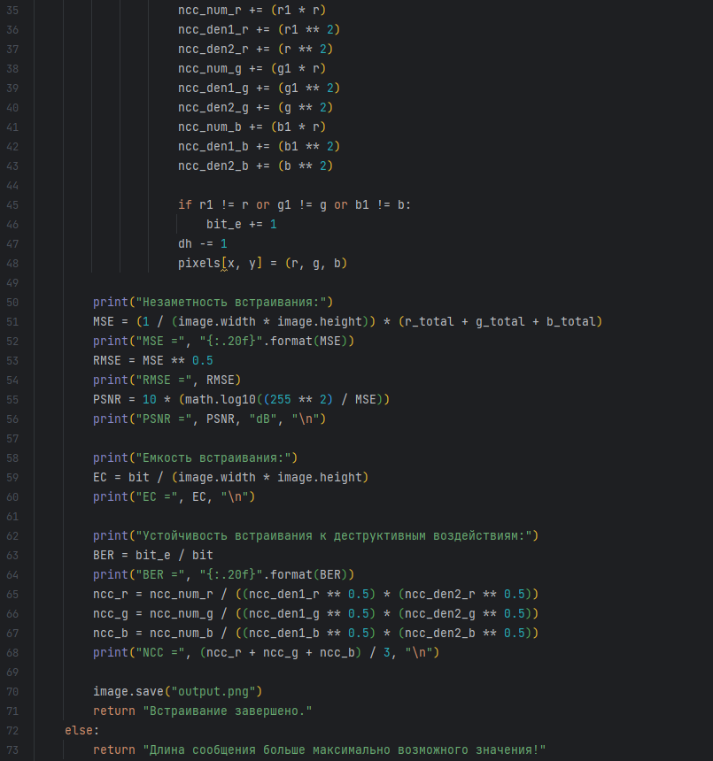 
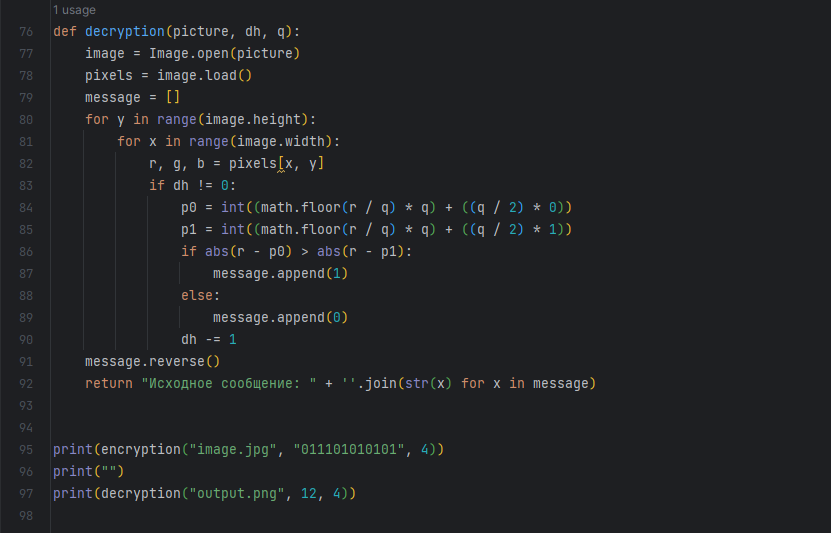 

При запуске программы получаем: 

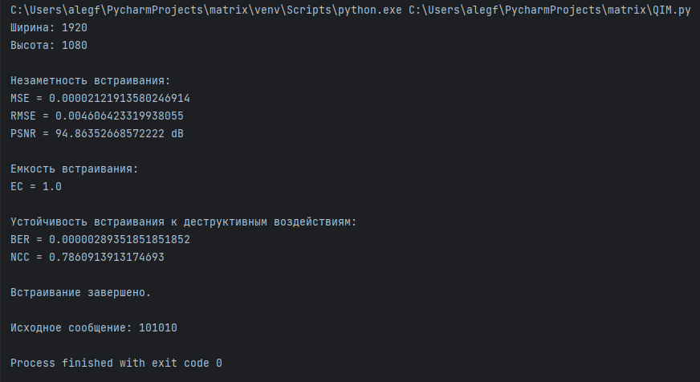

# 4 Вычислительные эксперименты

## 4.1 Встраивание максимально возможного объема информации

Выполним встраивание максимально возможного для данного контейнера объема
информации. Для этого возьмём для оценки фотографию, представленную на рисунке ниже:

Ширина этой картинки = 600 пикселей, высота = 800 пикселей. Для начала
встраиваем в изображение сообщение состоящее из одной "1". Для этого
используем функцию print(encryption(\"5.jpg\", \"1\", 4)) из программы,
предоставленной в 3 пункте. В данном случае метрики незаметности
встраивания имеют значения, продемонстрированные на рисунке ниже.

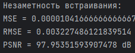 

Теперь встраиваем сообщение, состоящие из 480000 символов используя
функцию print(encryption(\"5.jpg\", \"1\" \* 600 \* 800, 4)). Получаем
значения незаметности встраивания, предоставленные на следущем рисунке:

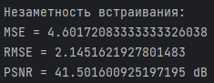 

В первом случае значения MSE и RMSE очень малы, а значение PSNR очень
высоко. Это указывает на то, что разница между оригинальным изображением
и стегоизображением очень мала, и встраивание информации было выполнено
с высокой степенью незаметности.

Во втором случае значения MSE и RMSE выше, а значение PSNR ниже. Это
указывает на то, что разница между оригинальным изображением и
стегоизображением больше, и встраивание информации было менее
незаметным.

Таким образом, сравнивая эти два случая, можно сказать, что в первом
случае встраивание информации было более незаметным, чем во втором
случае.

## 4.2 Измерение метрики незаметности встраивания

Проверим, как изменяются метрики незаметности встраивания от встраивания разного количества информации в то же изображение, что использовалось ранее в пункте 4.1.

Для этого воспользуемся функцией print из программы, представленной в
пункте 3. Получаем значения, продемонстрированные в таблице ниже:

| Размер сообщения от макс. возможного значения | Метрика MSE | Метрика RMSE | Метрика PSNR |
|-----------------------------------------------|-------------|--------------|--------------|
| 10 %                                          | 0.45496     | 0.6745       | 51.55098     |
| 25 %                                          | 1.14479     | 1.0699       | 47.54353     |
| 50 %                                          | 2.28488     | 1.5115       | 44.54216     |
| 75 %                                          | 3.43519     | 1.8534       | 42.77128     |
| 100 %                                         | 4.60172     | 2.1451       | 41.50160     |

В итоге получаем зависимость значений метрик незаметности встраивания от
размера сообщения. Значит, чем меньше значение MSE и RMSE, тем лучше
качество встраивания, и чем ниже значение PSNR, тем ниже качество
встраивания.

## 4.3 Встраивание сообщения с последующим сжатием

Встроим сообщения состоящие из 240 000 единиц в картинку,
которая использовалась ранее в пункте 4.1. Затем, применяем сжатие с помощью функции,
представленной на рисунке ниже.

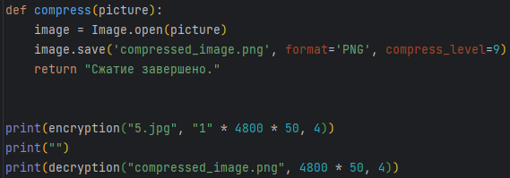 

Выполнив расшифровку, получаем:

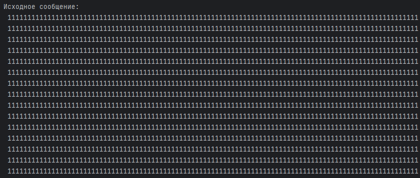 

Видим, что в результате сжатия картинки в формате png, исходное
изображение осталось тем же, что указывает на высокую робастность метода
встраивания.

## 4.4 Сравнение гистограмм изображений до и после встраивания

Встроим сообщения состоящие из 240 000 единиц в картинку, представленную
изначально в пункте 4.1. Для построения гистограмм воспользуемся программой,
представленной на следующем рисунке:

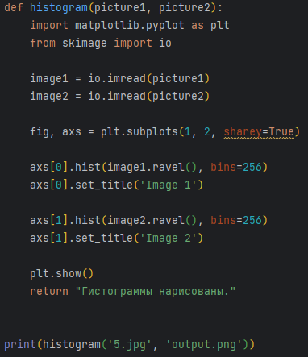 

Результат работы программы:

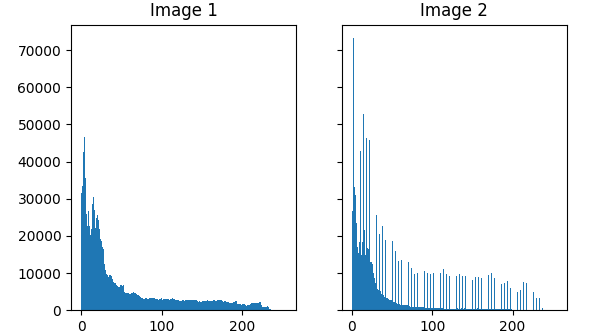

Гистограммы изображений показывают распределение значений пикселей в
двух изображениях, где image 1 – это картинка до встраивания, а image 2
– после встраивания. Сравнивая гистограммы двух изображений, можно
увидеть, как изменилось распределение значений пикселей. Видим, что
гистограмма стала более неровной и появились артефакты. Это указывает на
ухудшение качества изображения.

# 5 Выводы о проделанной работе

В ходе выполнения лабораторной работы были рассмотрены различные аспекты
сжатия изображений и встраивания информации в них. Были рассмотрены
различные метрики, используемые для оценки качества встраивания, такие
как MSE, RMSE, PSNR, BER и NCC. Также был получен навык программной
реализации стеганографического метода QIM.

# 6 Список использованных источников

Tutorial - Pillow. – URL: https://pillow.readthedocs.io/en/stable/handbook/tutorial.html (дата обращения 29.05.2023).
